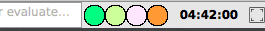

# ModifierKeysMorph

"How it looks in menubar"

Morph for Squeak to show current state of modifier keys (optionally in docking bar)

Developed and tested in Squeak 5.2

## What it does

It shows the state of Shift, Control, Mac-option, and Command, according to
Sensor (EventSensor).

## How to open it

To open it on its own:

`ModifierKeysMorph new openInWorld`

To open it in the world's main (first) docking bar:

`ModifierKeysMorph openInMainDockingBar`

## Q&A

### Does it use the colors I have selected in my theme?

No.  It uses colors chosen at semi-random at development time, through the
use of PizzaKeyMorph (which may be uploaded soon).

### Why did you make this?

Sometimes when I cmd-tab out of a Squeak window and come back, I find that
one or more of my modifier keys seem "stuck".  I'd like to figure out why.

### What have you learned so far?

RFB is tricky.

X11 / XQuartz from Mac into Linux VM is tricky.

